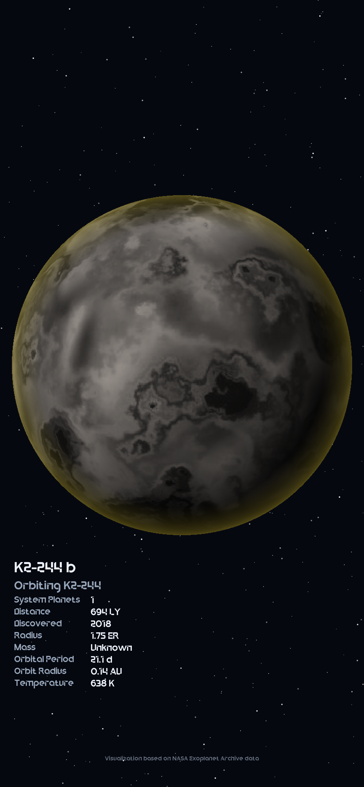

# Exoplanetarium
A customizable exoplanet poster generator using NASA's exoplanet archive TAP server: https://exoplanetarchive.ipac.caltech.edu/. Intended for generating backgrounds for mobile devices. Supports my [ticketer](https://github.com/Jer8Jun/ticketer) service, but can be used alone too.
### Example

## Customizing
*Note: If you are not planning to read the base64 encoded image from the output.json file, delete everything after `poster.create_planet_poster()` in main.py*

- To change the output post resolution, change `size=(x, y)` in `poster.create_planet_poster()`
- The default font is `Nexium.ttf`. To change this, add your font, and change the references in `poster.py`
- To change what information is displayed on the final poster, edit the `information` variable in `draw_planet_info()` in `poster.py`. *Note: if adding additional information ([options](https://exoplanetarchive.ipac.caltech.edu/docs/API_PS_columns.html)), you must also add the corresponding SQL query options to `tap_api.py`*
- To add additional planet textures or details, place them in the `textures` folder. Textures must be 1024x512 and desaturated. Additionally, you must add references to any new textures in `texture_gen.py` in either the `bases` or `details` table.
- To add additional planet varieties, create new entries in the same tables as mentioned above. The new entries will automatically be considered by the generator.
## Usage
You must be connected to the internet when running this script. Requires the following packages:
```bash
pip install pillow requests numpy
```
Run with the following command:
```bash
python3 main.py "path/to/output"
```
If no path is specified, the script's directory will be used. The program will create:
- `planet.png`: A png of the generated planet
- `wallpaper.jpg`: The exported poster with embedded text
- `output.json`: A file containing the image, compressed and base64 encoded (this is retrieved by the ticketer service):
```json
{"image":"<base64 encoded image>"}
```